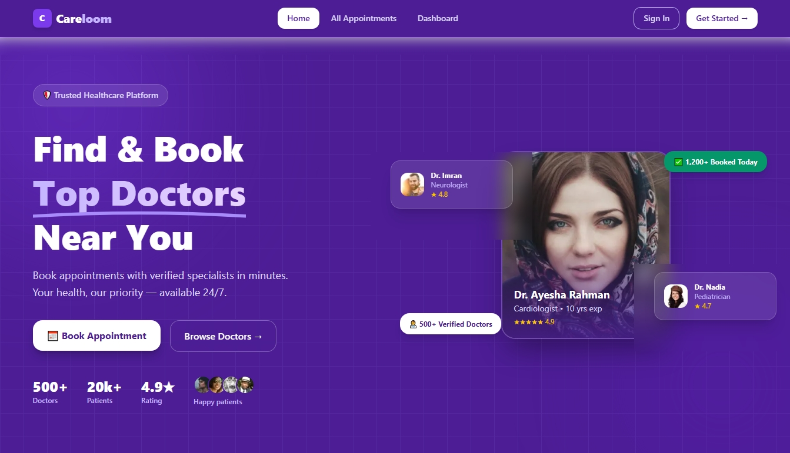
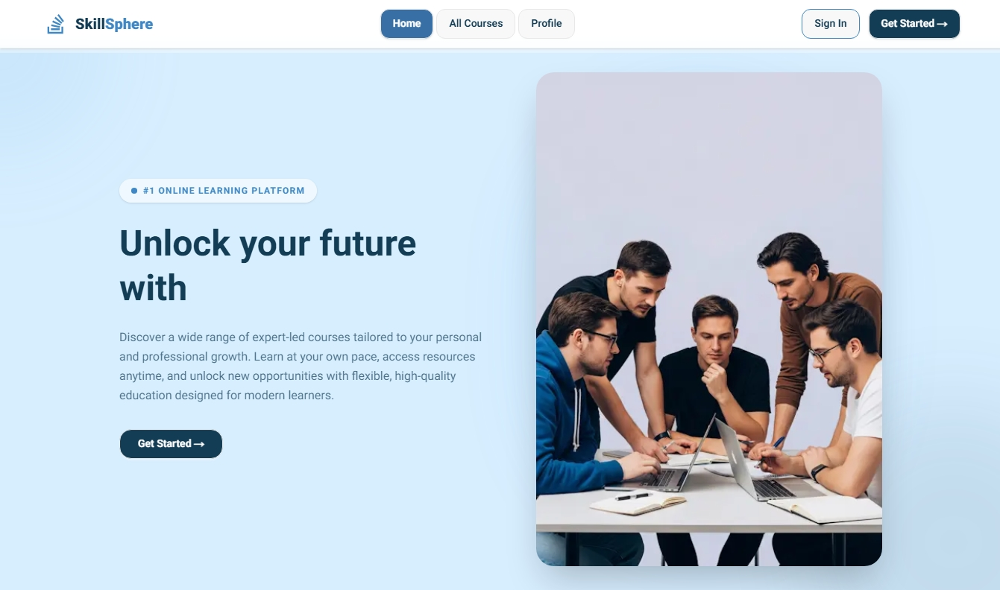
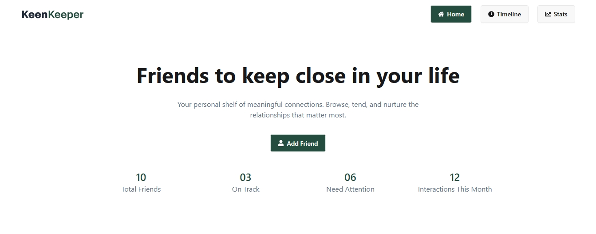

<h1 align="center">Hello There! 👋</h1>
 

  

  

  Aspiring Full-Stack Developer 👋 | Skilled in JavaScript, React.js, Next.js, Tailwind CSS, Node.js, MongoDB | Building Responsive UIs & Seamless API Integrations 🌍 | Tech Enthusiast & UI/UX Advocate 💡

  
  
  
  
  

  

---
 
<table border="0">
  <tr>
    <td width="60%">
      <h3 align="center">👨‍💻 About Me</h3>
      

        I am a <b>Front-End Web Developer</b> from Bangladesh, specializing in modern JavaScript, API integration, and responsive UI design. I thrive on translating complex designs into high-performance, accessible web applications.
      

      <ul>
        <li>🚀 Currently expanding my tech stack with <b>Node.js, Express.js, and the MERN stack</b>.</li>
        <li>🎯 Ultimate Goal: Building secure, full-stack software.</li>
        <li>💼 Actively seeking <b>Junior Front-End roles</b> to contribute and grow.</li>
        <li>🤝 Open to code reviews and open-source collaboration!</li>
      </ul>
    </td>
    <td width="40%" align="center">
      
    </td>
  </tr>
</table>

---
 
<h3 align="center">🛠️ Technical Arsenal</h3>
 
**Frontend & Styling**

  

**Backend & Databases**

  

**Tools & Design**

  

---
 
<h3 align="center">🚀 Featured Projects</h3>
 
<table>
  <tr>
    <td width="33%" align="center" valign="top">
      
        
      <b>Careloom</b>
       
      Doctor Appointment Management System
        
      
      &nbsp;
      
       
      

      

        A modern healthcare platform for discovering specialists, booking appointments securely, and managing everything through a personal dashboard.
      

      

        ✦ Multi-specialty doctor browsing 
        ✦ JWT + Google OAuth auth 
        ✦ Protected booking dashboard 
        ✦ Fully responsive UI
      

    

      

        <b>Stack:</b>
        

          <code>Next.js</code> <code>Express.js</code> <code>MongoDB</code> <code>Tailwind CSS</code> <code>JWT</code> <code>Better Auth</code>
        

      

    </td>
    <td width="33%" align="center" valign="top">
      
        
      <b>SkillSphere</b>
       
      Online Learning Platform
        
      
      &nbsp;
      
       
      

      

        A polished learning platform where users discover and explore skill-based courses with smooth animations, full auth, real-time search, and a personalised profile system.
      

      

        ✦ Real-time course search &amp; filter 
        ✦ Google + email auth 
        ✦ Protected redirect-after-login 
        ✦ Toast notifications throughout
      

      

      

        <b>Stack:</b>
        

          <code>Next.js</code> <code>MongoDB</code> <code>Tailwind CSS</code> <code>BetterAuth</code> <code>Animate.css</code>
        

      

    </td>
    <td width="33%" align="center" valign="top">
      
          
      <b>KeenKeeper</b>
       
      Friendship Relationship Manager
        
      
      &nbsp;
      
       
      

      

        A unique friendship management app to track interactions, log communication timelines, and visualise friendship analytics with interactive Recharts pie charts.
      

      

        ✦ Interaction timeline tracking 
        ✦ Filter by interaction type 
        ✦ Pie chart analytics dashboard 
        ✦ Custom 404 &amp; loading states
      

      

      

        <b>Stack:</b>
        

          <code>Next.js</code> <code>React.js</code> <code>Tailwind CSS</code> <code>Recharts</code> <code>DaisyUI</code>
        

      

    </td>
  </tr>
</table>

---
